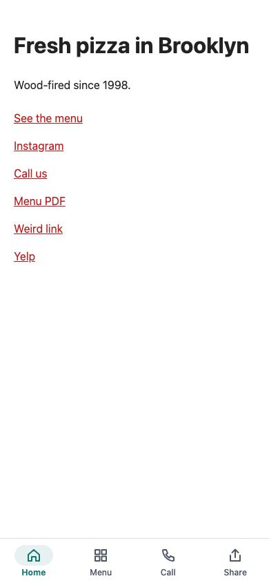
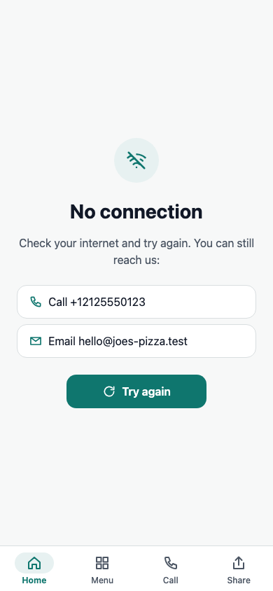
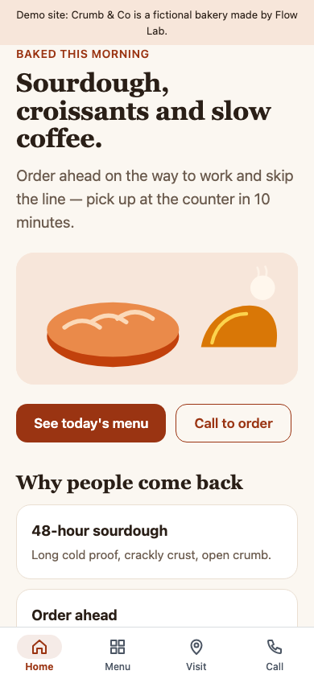

# Site-to-app kit: a website as an iOS and Android app (Expo)

A kit by Flow Lab for turning an existing website into a store-ready app for iOS and Android, built with Expo and React Native. The public demo wraps **Crumb & Co**, an invented bakery; its site lives in `demo-site/`. This is a demo on made-up data, not client work.

- Live demo: https://flowlab-dev.github.io/demo/site-app/
- Case study: https://flowlab-dev.github.io/work/site-app/

| No internet | On a phone |
|---|---|
|  |  |

## Why not just a web view

Apple rejects apps that are "a repackaged website" (App Review Guideline 4.2, Minimum Functionality). So the kit adds real native parts around the site:

- a native bottom tab bar (2–5 tabs) built from the site's menu; the site's own header, footer and cookie bar are hidden inside the app;
- an offline screen (and a separate "site not responding" screen for 5xx errors) with Call and Email buttons that work without internet, and automatic retry, because App Review almost always tries airplane mode;
- Call and Share tabs, swipe back on iOS, the Android back button through the site's history;
- links: other sites open in the phone's browser, while the site's own payment and booking steps (PayPal, Stripe, Shop Pay, Calendly: the `flowHosts` list) stay inside so the cart is not lost;
- a splash screen until the first load (no white flash), a loading bar, and a reload if the web process crashes (a common cause of the "white screen");
- deep links (`<scheme>://menu`) and optional push notifications that open the right page (`push.enabled`);
- photo uploads from the site's forms: camera, photo and microphone permission texts are already in `app.json`.

## Check a site first

    node tools/check-site.mjs https://example.com

Prints the risks, suggests tabs from the site's menu, finds the phone number, email, colours and icon, and drafts the settings for `src/site.config.ts`. Traffic light:

- 🟢 the business owns the site, it is on https, works on phones and has several sections;
- 🟡 "Sign in with Google" on the site: Google blocks it inside apps, and Apple then also requires Sign in with Apple;
- 🔴 the site belongs to someone else (Google Play forbids wrapping a site without the owner's permission), gambling, or a single page with nothing to add.

`node tools/report.mjs https://example.com [--lang ru]` turns the check into a first-stage report for the owner (English or Russian); see `sample/`.

## Build it for a site

1. Put the check's draft into `src/site.config.ts` (tabs, what to hide, colours, contacts, texts).
2. In `app.json` set `name`, `slug`, `scheme`, `ios.bundleIdentifier` and `android.package` to the owner's reverse domain (the tests reject `com.example.*` and the kit's own `dev.flowlab.*`).
3. `npm install`, then `npm run check`: types, tests, iOS and Android JS builds, the web preview, the page test and the demo test.
4. Build in the cloud on the owner's accounts: `npx eas-cli build -p all --profile preview`, then `--profile production` and `npx eas-cli submit`. No Xcode needed.

## What the site owner provides

1. Ownership of the site (or the owner's written permission).
2. Apple Developer and Google Play Console accounts in their name, with a role for the developer.
3. A square logo (1024×1024, no transparency) and an app name of up to 30 characters.
4. A Privacy Policy page and a support contact on the site, because both stores require them.
5. For a personal Google Play account created after 13 Nov 2023: a closed test with 12 testers for 14 days before release (Google's rule).

## Tests

    npm test            # logic: routing, config rules, colours and contrast, the site check (runs without node_modules)
    npm run test:page   # the app's web preview in headless Chrome
    npm run test:demo   # the public demo build

The page tests use `CHROME_PATH`, or `chrome-headless-shell` in the repo folder, or the installed Chrome.

## Built with

Expo SDK 57, React Native 0.86, react-native-webview, expo-notifications, TypeScript. Built by Flow Lab with Claude Code; every change is tested before it ships.

## Your website as an app

Write to trading.flowlab@gmail.com or @flowlabdev on Telegram with your site's address. The first step takes 1 to 2 days: a check of your site and a test build you can install on your phone.

## License

MIT
