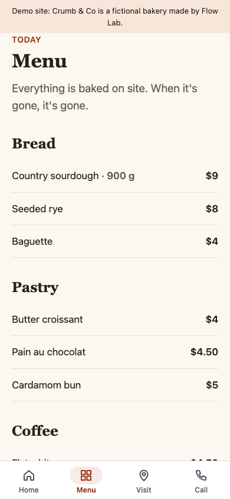
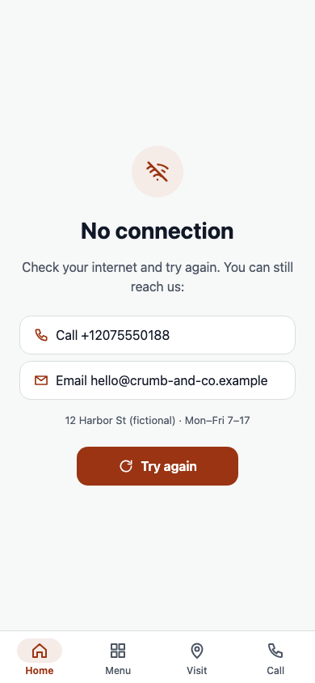

> Sample report on our demo bakery (Crumb & Co is fictional) — this is what you get for your own website at the first stage.

# Your website as an app — first-stage report: Crumb & Co

Site: https://flowlab-dev.github.io/demo/site-app/site/ · checked 2026-09-28

**Verdict: ready to become an app.** 2 to prepare · 1 note.

## What we checked

|  | Check | Result | What it means |
|---|---|---|---|
| ✅ | Secure connection (https) | yes | The app can open your pages. |
| ✅ | Phone layout | yes | Your pages already fit a phone screen. |
| ✅ | Your menu → app tabs | Home · Menu · Visit · Call | The native bar at the bottom of the app; your own header and footer are hidden inside the app. |
| ✅ | Phone for one-tap call | +1 207 555 0188 | A Call tab, and a call button on the "no internet" screen that works offline. |
| 🟡 | App icon | not found | Send your logo as a square image — the App Store icon is 1024×1024 without transparency. |
| 🟡 | Privacy Policy page | not found | Both stores require a public Privacy Policy page. Please add one to the site (we can place the text you approve). |
| ⚪ | Ownership | your site | Google Play accepts an app of a website only from its owner (or with written permission). |

## What the app adds beyond your website

Apple rejects apps that are "a repackaged website" (App Review Guideline 4.2). Your app gets native parts:
- a bottom tab bar made from your menu, with your own header and footer hidden
- a "no internet" screen with your phone and email — it works offline
- other websites, maps, phone and email open in the phone's own apps; the app stays where it was
- back gesture (iPhone) and back button (Android) through your pages, and a Share tab if you want one
- optional: push notifications for news and offers that open the right page (a separate stage)

## How your app will look

## What we need from you

1. Store accounts in your name: Apple Developer ($99 a year) and Google Play Console ($25 once). We publish from your accounts; you own the app.
2. Your logo as a square image, and the app name (up to 30 characters).
3. A public Privacy Policy page on your site.
4. Someone to try the test build on their phone (iPhone: TestFlight; Android: a link).
5. Google Play, personal developer account created after 13 Nov 2023: before the app goes live, 12 testers must stay in a closed test for 14 days in a row (Google's rule). A company account does not have this step.

## Plan, step by step

1. Test build of your app on your phone — 1–2 working days after we start.
2. Your feedback and one round of changes.
3. Store pages: name, description, screenshots, privacy answers.
4. Submission from your accounts and answers to the reviewers. Review time is set by Apple and Google.
5. After launch: updates when your site changes are not needed — the app shows your live pages.
